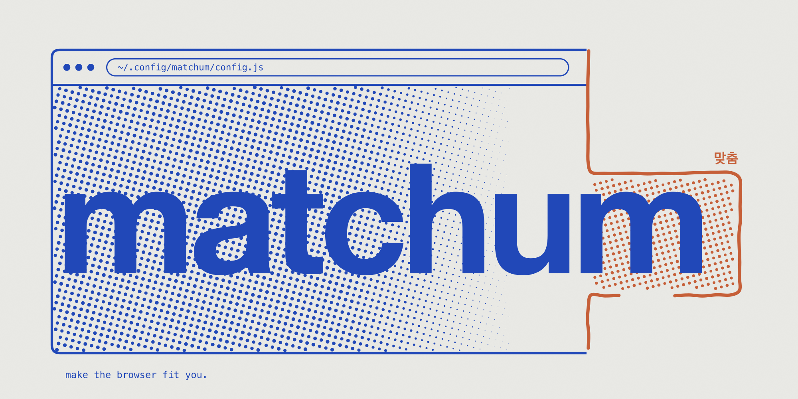
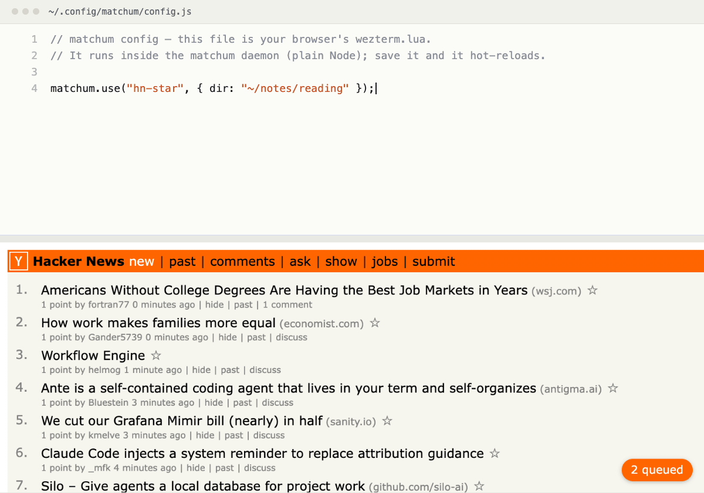

<p align="center">
  
</p>

# matchum

**Make the browser fit you.**

<p align="center">
  
</p>
<p align="center"><sub>Save <code>~/.config/matchum/config.js</code> and the open tab changes. No build, no extension reload.</sub></p>

*Matchum* (맞춤) means “made to fit” in Korean. Give your browser a config file, then
observe, react, and reshape the web with ordinary JavaScript — without building
a Chrome extension for every idea.

Install matchum once. Build everything else as code.

> [!CAUTION]
> matchum lets trusted local code and agents act as you inside your signed-in Chrome profile. A
> config or recipe can use your browser sessions and full user privileges. Read the
> [security model](#security-model) before installing, and never run code you do not trust.

## A daemon between your browser and your agents

matchum gives Chrome one general-purpose extension layer. Tabs, pages, browser events, and
DOM behavior become programmable from `~/.config/matchum/config.js`; save the file and the
change takes effect in the browser that is already open. The config runs in a local Node
daemon, so it can also keep state, write files, make network requests, or call other
programs.

```js
// ~/.config/matchum/config.js

matchum.use("tab-groups", { rules: [{ match: /github\.com/, group: "gh" }] });
// Matching GitHub tabs join a "gh" group when they update.

matchum.on("tab.updated", (tab) => matchum.log("visited", tab.url));

matchum.watch(/news\.ycombinator\.com/, ".titleline", ({ items }) => {
  if (items.some((t) => /Rust/.test(t))) matchum.notify("Rust on HN front page");
});

matchum.style(/claude\.ai/, `nav { display: none }`);

matchum.overlay("focus-note", /docs\.google\.com/, {
  html: `<button data-matchum-toggle>focus</button><p>Write the next sentence.</p>`,
  css: `.matchum-wrap { margin: 16px; padding: 12px; background: white; color: black; }`,
});
```

Those are not separate extension projects. They are a few pieces of a config that can be
edited, combined, removed, and versioned like dotfiles. A fresh install starts with an
intentionally inert [config.example.js](config/config.example.js). Copy individual ideas from
the opt-in [showcase config](examples/config.showcase.js) when you want navigation history,
live page archiving, site theming, or widgets.

## Why matchum exists

I spend more time in the browser than in any other application, yet it is the one I can
least make my own. A terminal or editor can grow around the way I work; a browser is
mostly a fixed product plus whatever someone else decided to publish in an extension
store.

Chrome extensions are powerful, but they are the wrong unit of effort for a personal
idea. A small change still asks for a manifest, permissions, service worker/content script
boundaries, message plumbing, installation, and reload choreography. Most ideas are not
worth turning into a separate software project, so they never get built.

[WezTerm](https://wezterm.org/) showed me how powerful a tool becomes when its
configuration is a real program. What stuck with me was how `wezterm.lua` turns a fixed
application into a malleable personal environment. matchum brings
that kind of extensibility to the browser — the channel where so much of modern work and
life now happens.

## What becomes programmable

| Intent | matchum surface |
|---|---|
| Observe and remember | browser events, `page.activity`, full Node APIs and local files |
| React over time | rules, timers, DOM watches, notifications |
| Reshape a site | live styles and persistent user scripts |
| Add a personal feature | shadow-DOM overlays and recipe pages |
| Inspect and act now | tabs, page text, queries, execution, snapshots, clicks and typing |

Standing behavior keeps running without an agent. When an agent does join, it sees the
same programmable surface: it can inspect the live page, prototype a change, edit the
config, watch it hot-reload, debug the result in place, and leave the finished behavior
behind as a recipe you own.

## Architecture

```
config.js (standing behavior) ──┐
                                ├── daemon (Node; authoritative handlers, timers and state)
matchum-ctl (one-off commands) ─┘        │
                                        │ Native Messaging
                                        ▼
                                Chrome extension (MV3)
                                        │
                                        ▼
                                    tabs / pages
```

The extension is a thin browser-facing sensor/actuator. The daemon stays alive while
Chrome is connected, keeps user code out of the disposable MV3 service worker, and gives
config and CLI calls one shared runtime. An agent extends matchum by editing the config and
recipes, and interacts with it through `matchum-ctl`.

## Install

Requires macOS + Chrome 135 or newer + Node 22 or newer. (Other platforms are untested: the
daemon is plain Node, but the installer is a zsh script that needs `openssl` and defaults to
Chrome's macOS native-messaging directory — override it with `MATCHUM_NATIVE_HOST_DIR`.)

For a stable local install from a checkout of this repository:

```sh
./scripts/install.sh
# chrome://extensions → Developer mode → "Load unpacked"
# choose ~/.local/share/matchum/extension
# Chrome 138+: on the extension's details page, enable "Allow User Scripts"
~/.local/bin/matchum-doctor
~/.local/bin/matchum-ctl tabs
```

The installer copies a self-contained runtime to `~/.local/share/matchum`, keeps the extension
identity at `~/.config/matchum/key.pem`, registers Chrome's native host, and seeds an inert
config without overwriting an existing one. If an older checkout contains `scripts/key.pem`,
the installer migrates it automatically so Chrome keeps the same extension ID. Re-run the same
command for an atomic update; the previous managed runtime is retained as
`~/.local/share/matchum.previous`.

For development, point Chrome and the native host directly at the checkout:

```sh
./scripts/install.sh --dev
# Load this checkout's extension/ directory, then:
~/.local/bin/matchum-ctl ext-reload
```

`./scripts/install.sh uninstall` removes the managed runtime and native-host registration. It
intentionally retains config, state, and the identity key. Remove the unpacked extension from
`chrome://extensions` separately. The remaining examples assume `~/.local/bin` is on `PATH`.

## Config API

| | |
|---|---|
| `matchum.on(event, fn)` | `tab.created/updated/removed/activated`, `window.focused`, `idle.changed`, `page.activity`, `script.msg` |
| `matchum.rule({match, action})` | act on tabs whose url/title matches |
| `matchum.every("30s", fn)` | periodic tasks |
| `matchum.watch(re, selector, fn)` | push-based page watching (MutationObserver, SPA-aware, debounced) |
| `matchum.style(re, css)` | inject CSS into matching pages — live theming, applied on save |
| `matchum.overlay(id, re, {html, css})` | shadow-DOM widget drawn on matching pages |
| `matchum.run(re, js)` | Tampermonkey-style persistent user scripts (`chrome.userScripts`) |
| `matchum.tabs.list() / find(re)` | wrapped tabs: `activate close reload moveToGroup text query exec snapshot click type screenshot visibleText` |

Config runs inside the daemon (plain Node), so `require("fs")` etc. just work. Handler errors
are isolated and logged to `~/.local/state/matchum/daemon.log`.

Config reloads are transactional: a broken candidate is fully disposed, while the
last-known-good handlers, timers, recipes, and page behavior stay active. Each failed reload
raises one system notification; the popup and `matchum-ctl status` keep exposing the error
until a later save succeeds.

`page.activity` is opt-in: the content script installs its input listeners only while at least
one config handler is registered for that event and a compatible daemon is connected.

## Recipes

Recipes are reusable units of personal browser behavior, not separately packaged Chrome
extensions. `matchum.use("name", opts)` loads one into the config; toggle it from the toolbar
popup or `matchum-ctl on|off <name>`. State persists across reloads.

Recipes resolve from `~/.config/matchum/recipes/` (yours, versioned however you version
your dotfiles) first, then from the repo's `config/recipes/` (shipped examples — currently
**tab-groups**, auto-grouping tabs by URL pattern). A recipe is one file exporting
`(matchum, opts) => { ... }` (installation is synchronous) — add
`module.exports.description` for the popup,
`module.exports.page` for its own report page at
`chrome-extension://<id>/page.html?recipe=<name>`.

Things this makes easy: a site auto-translator, a reading companion, a browsing log, or a
site-specific tool panel. Recipes run in plain Node, so storage is whatever you want — JSONL,
SQLite, or another local system.

A recipe that throws during installation is reported in the popup and all of its partial
registrations are rolled back. Editing a recipe or any local CommonJS helper it loads triggers
the same dependency-aware, transactional reload as editing the main config. Require local
helpers at config/recipe installation time (normally at module top level), even if a handler
calls `require()` again later. A module first loaded inside a running handler is invisible to
the transactional reload, so hot reload does not cover it.

## Build and debug in the live browser

The short feedback loop is the feature. Start with the page already open, inspect its DOM,
prototype against it, move the working behavior into config, and save. matchum hot-reloads the
config, recipes, and their local CommonJS dependencies; watches, styles, and overlays update
pages already open. Most iterations need no extension build, manifest edit, reinstall, or
extension reload.

For example, an agent — or you at the CLI — can probe a live page:

```js
const tab = await matchum.tabs.find(/github\.com/);
await tab.query("nav");
await tab.exec(`
  const nav = document.querySelector("nav");
  if (!nav) throw new Error("nav not found");
  nav.style.opacity = "0.25";
  return getComputedStyle(nav).opacity;
`);
```

Once the idea is right, it becomes standing behavior:

```js
matchum.style(/github\.com/, `nav { opacity: 0.25 }`);
```

An agent with shell access can close this loop itself: inspect with `matchum-ctl`, edit the
config or a recipe, read daemon errors (`tail -f ~/.local/state/matchum/daemon.log`), and
verify the result in the same authenticated page. What it builds becomes user-owned code rather than disappearing with the agent
session. If an idea needs a new low-level Chrome capability, that capability still belongs
in matchum's core extension; everyday combinations like the ones above never need core changes.

## CLI and one-off control

The CLI is an interactive handle on the same runtime used by config. It addresses the
Chrome already on screen rather than launching a separate automation browser.

```sh
matchum-ctl status                        # daemon, extension protocol, and config health
matchum-ctl tabs                          # list open tabs
matchum-ctl eval '<js>'                   # run async JS inside the daemon (matchum API in scope)
matchum-ctl exec <regex> '<js>'           # run JS inside the first matching tab (return/await ok)
matchum-ctl snapshot <regex> [--viewport] # actionable elements {i, role, name}; on-screen only with the flag
matchum-ctl visible <regex>               # text currently on screen in that tab
matchum-ctl shot <regex> [file]           # screenshot to png
matchum-ctl recipes / on|off <name>       # list and toggle recipes
matchum-ctl notify|reload|ext-reload      # notification, config reload, extension+daemon reload
```

Run `matchum-doctor` to validate Node, the managed install, identity consistency, native-host
registration, config, and the live daemon handshake without printing key material.

`eval` is the universal escape hatch:

```sh
matchum-ctl eval 'const t = await matchum.tabs.find(/github/); return await t.query("h1")'
matchum-ctl eval 'for (const t of await matchum.tabs.list()) if (/docs\./.test(t.url)) await t.reload()'
```

The same surface supports agent action loops when control is what you need:

```js
const tab = await matchum.tabs.find(/claude\.ai/);
const snap = await tab.snapshot();
const box = snap.items.find((item) => item.role === "textbox");
await tab.type(box.i, "hello", { enter: true });
await tab.visibleText();
```

- `click` and `type` return action details plus navigation or read-back evidence, often
  avoiding a separate verification call.
- Multi-step, judgment-free work can run inside one `eval`, including assertions and
  parallel background-tab work.
- Selectors and site knowledge discovered during one-off work can graduate into config or
  a reusable recipe.

## Security model

matchum removes repeated extension ceremony by installing a powerful bridge once. That also
means its trust boundary is intentionally broad:

1. Config and recipes are trusted local programs. They run in Node with your user
   privileges, including filesystem, network, and subprocess access.
2. The extension can inspect and modify ordinary web pages and act through your signed-in
   sessions. Code using it can post, send, purchase, or delete as you.
3. Page content is untrusted input. An agent that reads it can be targeted by prompt
   injection and steered toward privileged browser actions.
4. matchum has no sandbox or internal permission system. Core components make no telemetry or
   other external network requests; `page.activity` data is produced only while you have a
   handler registered, and it never leaves your machine. Audit the source and every config or
   recipe before running it; the codebase has zero npm dependencies and a detailed
   [`spec.md`](spec.md).
5. If you want isolation instead of a personal power tool, use a disposable automation
   profile rather than your everyday browser.

The broad extension permissions are the product boundary, not incidental convenience:

| Permission | Why it is required |
|---|---|
| `<all_urls>` | observe opted-in DOM watches and apply configured styles, overlays, scripts, and actions on matching pages |
| `tabs`, `tabGroups` | inspect, activate, open, close, reload, and group tabs |
| `scripting`, `userScripts` | perform one-off page actions and install persistent user code through Chrome's sanctioned MV3 API |
| `nativeMessaging` | connect the extension to the local Node runtime |
| `notifications` | deliver explicitly configured local notifications |
| `storage`, `alarms`, `idle` | retain distribution state across service-worker sleeps, reconnect the native host, and emit configured idle-state events |

Local files are similarly explicit: config and the private identity key live under
`~/.config/matchum`; installed code under `~/.local/share/matchum`; and the socket, logs,
screenshots, recipe switches, and any example-created data under
`~/.local/state/matchum`. See [SECURITY.md](SECURITY.md) for the reporting policy and precise
trust boundary.

## Limits

- Chrome stable, one profile; daemon lifetime is tied to the Chrome connection.
- No alert/confirm dialog handling, no network-level observation (would need `chrome.debugger`).
- `snapshot` doesn't descend into iframes or shadow DOM.
- Chrome 138+ requires "Allow User Scripts" for `matchum.run`/`exec`; Chrome 135–137 uses
  the Developer mode toggle instead (MV3 forbids other remote-code paths).

## FAQ

**How is this different from Playwright or a browser MCP server?**
They solve a different problem well: driving a browser to finish a task, usually in a
separate automation instance. matchum changes the ongoing behavior of the Chrome you
already use. It installs the privileged bridge once, then makes observation, reaction,
page modification, and new UI ordinary user-space code — control is one thing the layer
can do, not the reason it exists.

**How is this different from Tampermonkey?**
`matchum.run` covers that ground: persistent user scripts in pages. matchum pairs the
page side with a Node daemon, so the same config also gets state, files, network,
timers, notifications, and a CLI.

**Why isn't this on the Chrome Web Store?**
matchum is meant to be installed from source you have read and can edit. An unpacked
extension keeps the identity key on your machine and the code yours to change; a store
listing would add review ceremony without adding trust.

## Development

- Full spec: [`spec.md`](spec.md)
- Security policy: [SECURITY.md](SECURITY.md)
- Release checklist: [RELEASING.md](RELEASING.md)
- `./scripts/install.sh --dev` — points the installed host and unpacked extension at this
  checkout while preserving the stable identity outside the repository.
- `npm test` — syntax-checks every JavaScript entry point, runs the pure logic unit tests,
  exercises the daemon end-to-end through a fake-extension harness, and tests install/update/
  uninstall in isolated directories on supported shells.
- Pure decisions live in `daemon/lib/` and `extension/lib/core.js`; `daemon.js`,
  `background.js`, and `watcher.js` keep the filesystem, protocol, `chrome.*`, and DOM glue.
- `matchum-ctl ext-reload` after touching daemon or extension core. Config, recipes, and their
  local CommonJS helpers reload automatically when saved.
